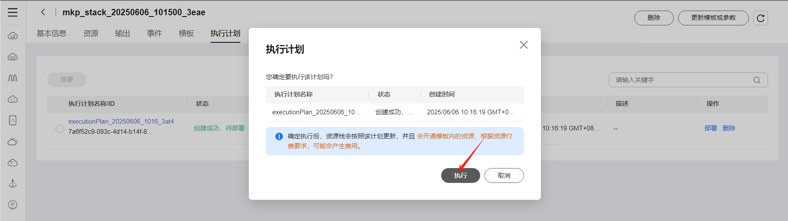
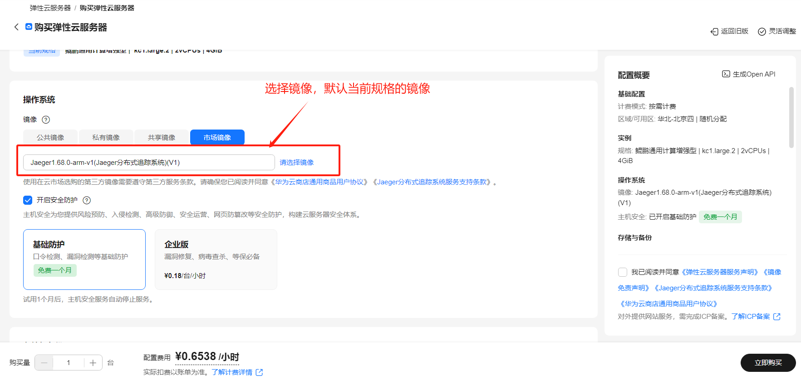
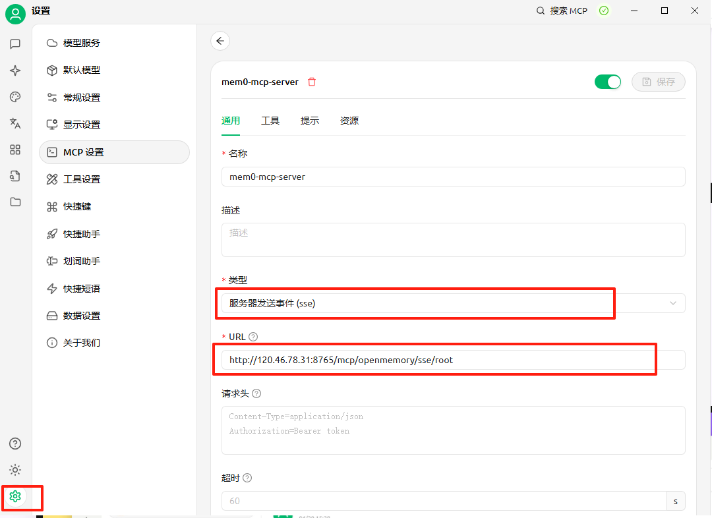
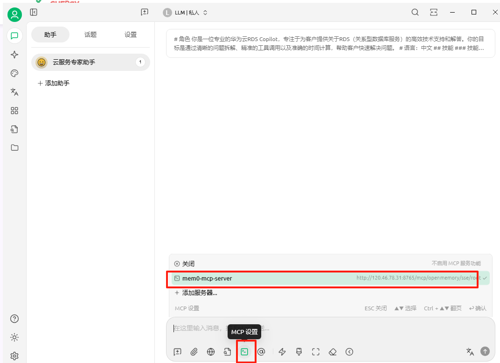

# openmemory-mcp Service
## Product Link
[openmemory MCP service](https://marketplace.huaweicloud.com/intl/hidden/contents/c4155469-8f2c-42d6-8d0c-ec927a56161f)

## Product Description
[openmemory](https://github.com/mem0ai/mem0/tree/main/openmemory) OpenMemory MCP is a private, local first memory layer built on Mem0 (AI Agent Memory Layer), specifically designed for MCP (Model Context Protocol) compatible clients. Its core mission is to enable persistent, context aware collaboration among different AI tools such as Cursor, Claude Desktop, Windsurf, Cline, etc

This product is provided as a pre-installed image on Kunpeng Cloud with Ubuntu 24.04 and HCE 2.0 systems for user convenience.

## Purchasing the Product
You can search for "openmemory-mcp" in the Cloud Marketplace. 
For configuration:

- Select recommended region and specifications
- Choose billing method (Pay-as-you-go/Monthly/Yearly) based on your needs:
  - Short-term use: Recommended Pay-as-you-go
  - Long-term use: Recommended Monthly/Yearly
- Click "Buy Now" after confirming configuration

### Deploy Using RFS Template

Fill in required fields and click Next

After creating the plan, click Confirm

Click Deploy to execute the plan

"Apply required resource success" indicates successful resource creation

### ECS Console Configuration
#### Prerequisites

Before ECS console configuration, you need to set up **Security Group Rules**:

> **Security Group Rules Configuration:**
> - Allow inbound port 8000, with source IP including your client IP (otherwise access will be denied)
> - Allow inbound port `22` for CloudShell connection (for console debugging)
> - Enable all outbound traffic

#### Creating ECS

After preparation, navigate to [ECS Purchase](https://support.huaweicloud.com/qs-ecs/ecs_01_0103.html) page with the following configuration:

Select CPU Architecture

Select Server Specifications

Select Image

Complete other parameters as needed, then click "Buy Now"

> **Important Notes:**
- You may create your own VPC
- Select the security group configured in [**Prerequisites**](#prerequisites)
- For Elastic IP, select "Buy Now" and choose "Pay-by-traffic" (recommended 5Mbit/s bandwidth)
- Advanced configuration requires custom data injection, so select "Set Later" for login credentials
- Other options can remain default or be configured as needed

## Product Usage
### Using openmemory mcp service
### Download Cherry Studio client

https://www.cherry-ai.com/；And install it

Click on the left small corner settings, click on model services, and configure the API key provided by the model vendor.

###  MCP configure

Click on "Settings" in the bottom left corner, then click on "MCP Settings" to configure the MCP service. Fill in the service name, communication type, and URL address

### start service

Click on the MCP settings under the input box, and then click on the mem0 mcp server that was just configured to enable the service

### Reference Documentation
https://docs.mem0.ai/openmemory/overview
