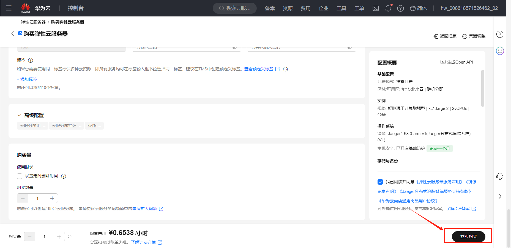

# openmemory-mcp服务
## 商品连接
[openmemory MCP服务](https://marketplace.huaweicloud.com/hidden/contents/f99f5fc8-4cf1-4dc9-92a7-8ffc4dd2805e#productid=OFFI1135139479874867200)

## 商品说明
[openmemory](https://github.com/mem0ai/mem0/tree/main/openmemory) 是一个基于Mem0（AI代理的记忆层）构建的私有、本地优先的记忆层，专为MCP（Model Context Protocol）兼容客户端设计。它的核心使命是：让不同AI工具（如Cursor某、Claude某Desktop、Windsurf某、Cline某等）实现持久化、上下文感知的协作
本商品在鲲鹏云的上Ubuntu24.04和HCE2.0系统中进行安装后以镜像提供给用户使用。

## 商品购买
您可以在云商店搜索“openmemory-mcp”。 
其中，地域、规格、按照推荐配置使用，购买方式根据您的需求选择按需/按月/按年，短
期使用推荐按需，长期使用推荐按月/按年，确认配置后点击“立即购买”。

### 使用 RFS 模板直接部署

必填项填写后，点击 下一步

创建直接计划后，点击 确定

点击部署，执行计划

如下图“Apply required resource success. ”即为资源创建完成

### ECS控制台配置
#### 准备工作

在使用ECS控制台配置前，需要您提前配置好 **安全组规则**。

> **安全组规则的配置如下：**
> - 入方向规则放通端口8000，源地址内必须包含您的客户端ip，否则无法访问
> - 入方向规则放通 CloudShell 连接实例使用的端口 `22`，以便在控制台登录调试
> - 出方向规则一键放通

#### 创建ECS

前提工作准备好后，选择 ECS 控制台配置跳转到[购买ECS](https://support.huaweicloud.com/qs-ecs/ecs_01_0103.html) 页面，ECS 资源的配置如下图所示：

选择CPU架构

选择服务器规格

选择镜像

其他参数根据实际请客进行填写，填写完成之后，点击立即购买即可

> **值得注意的是：**
- VPC 您可以自行创建
- 安全组选择 [**准备工作**](#准备工作) 中配置的安全组；
- 弹性公网IP选择现在购买，推荐选择“按流量计费”，带宽大小可设置为5Mbit/s；
- 高级配置需要在高级选项支持注入自定义数据，所以登录凭证不能选择“密码”，选择创建后设置；
- 其余默认或按规则填写即可。

 ## 商品使用
### 下载Cherry Studio客户端

https://www.cherry-ai.com/；并安装

点击左小角设置，点击模型服务，配置模型供应商提供的API密钥。

###  MCP服务配置

点击左下角设置，再点击MCP设置，配置mcp服务，填写 服务名称、通信类型和 URL地址

### 启用服务

点击输入框下的MCP设置，点击刚才配置的mem0-mcp-server启用服务

## 参考文档

https://docs.mem0.ai/openmemory/overview